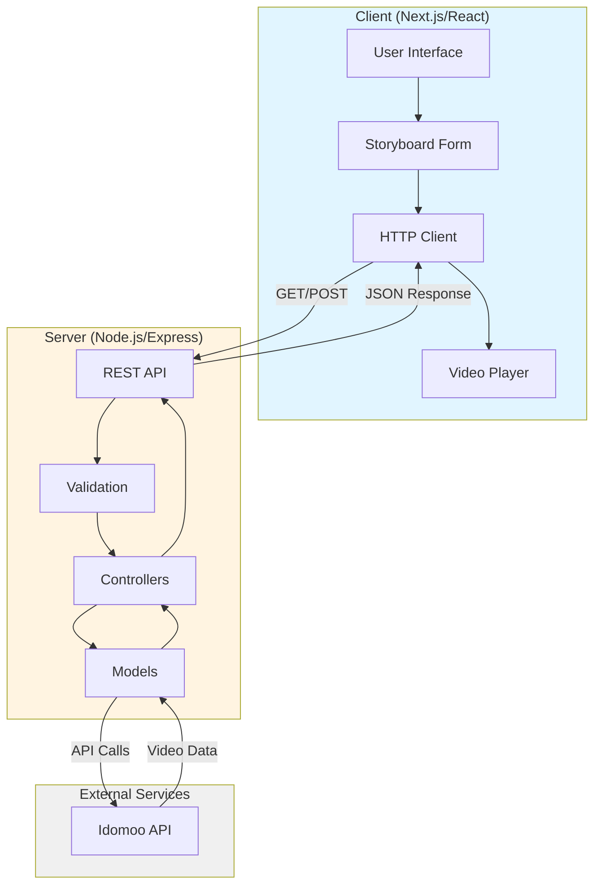

# Dynamic Video

A full-stack web application for generating personalized dynamic videos using the Idomoo API. The application allows users to customize video content through an interactive form interface and generates professional videos with custom text, colors, images, and rendering settings.

Built in 2023-2024. This application combines a Node.js/Express backend with a Next.js/React frontend to provide a seamless video generation experience.

## Features

- 🎬 **Dynamic Video Generation**: Create personalized videos using storyboard templates
- 📝 **Interactive Form Interface**: User-friendly form with real-time validation
- 🎨 **Customization Options**: 
  - Text fields (names, email, custom content)
  - Color picker for branding
  - Background image upload
  - Format selection (HLS, MP4, GIF)
  - Resolution options (1280x1280, 1920x1080, 2560x1440)
  - Quality levels (Best, Better, Good)
- 📊 **Progress Tracking**: Real-time status updates during video generation
- 🎥 **Instant Playback**: Automatic video preview once generation is complete
- 🔄 **RESTful API**: Well-documented Express API with Swagger UI
- ⚡ **Modern Stack**: Express + Next.js + Material-UI

## Architecture



## Getting Started

### Prerequisites

- Node.js (v18 or higher)
- npm or pnpm
- Active internet connection for Idomoo API

### Installation

1. Clone the repository:
```bash
git clone https://github.com/orassayag/dynamic-video.git
cd dynamic-video
```

2. Install server dependencies:
```bash
cd server
npm install
```

3. Install client dependencies:
```bash
cd ../client
npm install
```

### Configuration

#### Server Configuration

Edit `server/config/env.json`:
```json
{
  "server": {
    "port": "8080",
    "env": "local"
  }
}
```

Update API settings in `server/src/config/constants.config.js` if needed.

#### Client Configuration

Edit `client/src/config/constants.config.js`:
```javascript
SERVER: {
  BASE_URL: 'http://localhost:8080/api',
}
```

### Running the Application

1. Start the server:
```bash
cd server
npm run dev
```
Server runs on: `http://localhost:8080`

2. Start the client (in a new terminal):
```bash
cd client
npm run dev
```
Client runs on: `http://localhost:3000`

3. Access the application at `http://localhost:3000`

## Usage

### Generating a Video

1. **Load Storyboard**: The application automatically loads the storyboard template
2. **Fill Form**: Enter all required information:
   - Personal details (first name, last name, email)
   - Custom text fields from the storyboard
3. **Customize**: 
   - Upload background image
   - Choose color scheme
   - Select format, resolution, and quality
4. **Generate**: Click the "Generate" button
5. **Wait**: Progress bar shows generation status
6. **Watch**: Video plays automatically when ready

### API Documentation

Access Swagger UI documentation at: `http://localhost:8080/api-docs`

#### Available Endpoints

**GET** `/api/storyboards/:id`
- Fetch storyboard template by ID
- Returns array of field definitions

**POST** `/api/storyboards`
- Generate video from storyboard data
- Returns status check URL and video URL

## Project Structure

```
dynamic-video/
├── server/                    # Backend application
│   ├── src/
│   │   ├── bin/              # Server startup
│   │   ├── config/           # Configuration constants
│   │   ├── controllers/      # Route controllers
│   │   ├── custom/           # Custom error and event classes
│   │   ├── helpers/          # Express helpers
│   │   ├── middlewares/      # Express middleware
│   │   ├── models/           # Business logic models
│   │   ├── routes/           # API route definitions
│   │   ├── services/         # Services (logging, swagger)
│   │   ├── utils/            # Utility functions
│   │   └── validations/      # Joi validation schemas
│   ├── config/               # Environment configuration
│   └── package.json
│
├── client/                    # Frontend application
│   ├── src/
│   │   ├── components/
│   │   │   ├── common/       # Reusable UI components
│   │   │   └── pages/        # Page-specific components
│   │   ├── config/           # Client configuration
│   │   ├── hooks/            # Custom React hooks
│   │   ├── pages/            # Next.js pages
│   │   └── utils/            # Client utilities
│   ├── public/               # Static assets
│   └── package.json
│
├── CONTRIBUTING.md           # Contribution guidelines
├── INSTRUCTIONS.md           # Detailed setup instructions
├── LICENSE                   # MIT License
└── README.md                 # This file
```

## Development

### Server Development

```bash
cd server
npm run dev        # Start development server with nodemon
npm run test       # Run tests
```

### Client Development

```bash
cd client
npm run dev        # Start Next.js development server
npm run build      # Build for production
npm run lint       # Run ESLint
```

## Technology Stack

### Backend
- **Node.js** - Runtime environment
- **Express** - Web framework
- **Winston** - Logging
- **Joi** - Request validation
- **Swagger** - API documentation
- **Axios** - HTTP client

### Frontend
- **Next.js** - React framework
- **React** - UI library
- **Material-UI (MUI)** - Component library
- **SASS** - Styling
- **Axios** - API communication

## Contributing

Contributions to this project are [released](https://help.github.com/articles/github-terms-of-service/#6-contributions-under-repository-license) to the public under the [project's open source license](LICENSE).

Everyone is welcome to contribute. Contributing doesn't just mean submitting pull requests—there are many different ways to get involved, including answering questions, reporting issues, and improving documentation.

See [CONTRIBUTING.md](CONTRIBUTING.md) for detailed contribution guidelines.

## Security

- Never commit API credentials or sensitive data
- Use environment variables for configuration
- Follow OWASP security best practices
- Report security vulnerabilities privately to the maintainer

## Author

* **Or Assayag** - *Initial work* - [orassayag](https://github.com/orassayag)
* Or Assayag <orassayag@gmail.com>
* GitHub: https://github.com/orassayag
* StackOverflow: https://stackoverflow.com/users/4442606/or-assayag?tab=profile
* LinkedIn: https://linkedin.com/in/orassayag

## License

This application has an MIT license - see the [LICENSE](LICENSE) file for details.
