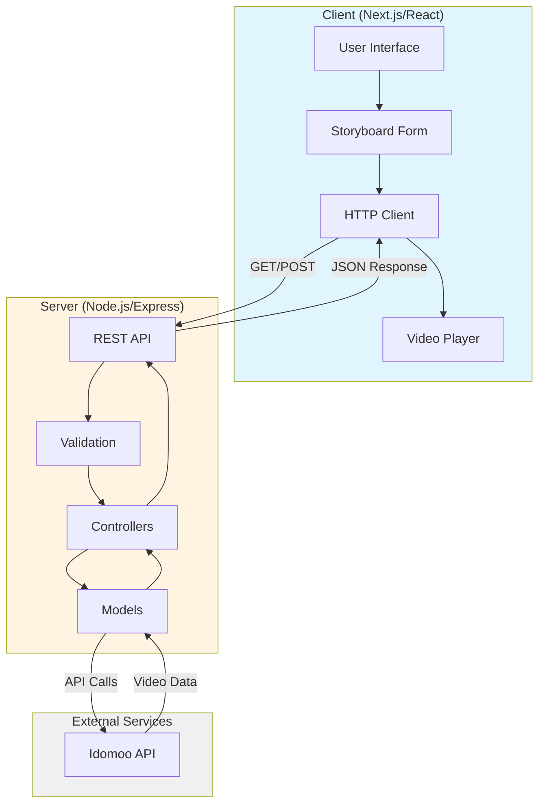

# Dynamic Video

A full-stack web application for generating personalized, high-quality dynamic videos through the Idomoo API. Users can customize storyboard-driven video content using an interactive interface with text inputs, branding colors, background images, output formats, resolutions, and quality settings

Built between 2023–2024, the project combines a Node.js/Express backend with a Next.js/React frontend, featuring real-time progress tracking, instant playback, RESTful APIs with Swagger documentation, request validation, and a modern Material-UI user experience.

## Features

- 🎬 **Dynamic Video Generation**: Create personalized videos using storyboard templates
- 📝 **Interactive Form Interface**: User-friendly form with real-time validation
- 🎨 **Customization Options**:
  - 📝 Text fields (names, email, custom content)
  - 🎨 Color picker for branding
  - 🖼️ Background image upload
  - 🎬 Format selection (HLS, MP4, GIF)
  - 📐 Resolution options (1280x1280, 1920x1080, 2560x1440)
  - ⭐ Quality levels (Best, Better, Good)
- 📊 **Progress Tracking**: Real-time status updates during video generation
- 🎥 **Instant Playback**: Automatic video preview once generation is complete
- 🔄 **RESTful API**: Well-documented Express API with Swagger UI
- ⚡ **Modern Stack**: Express + Next.js + Material-UI

### Core Capabilities

- **Storyboard Integration**: Load and customize storyboard-driven video templates
- **Video Rendering via Idomoo API**: Leverage Idomoo's powerful video generation capabilities
- **Progress Monitoring**: Track video generation status in real-time
- **Multiple Output Formats**: Support for HLS, MP4, and GIF formats
- **High-Quality Rendering**: Multiple resolution and quality options

### Technical Excellence

- **Express Backend**: Robust REST API with proper error handling
- **Winston Logging**: Structured logging for debugging and monitoring
- **Joi Validation**: Request validation for data integrity
- **Swagger Documentation**: Interactive API documentation
- **Next.js Frontend**: Modern React framework with server-side rendering
- **Material-UI**: Beautiful, accessible UI components

### Developer Experience

- **Hot Reloading**: Development servers with auto-reload
- **ESLint & Prettier**: Code quality and formatting
- **Clear Project Structure**: Organized client/server separation
- **Interactive Documentation**: Swagger UI for API exploration

### Architecture Principles

This project follows clean architecture principles:

1. **Separation of Concerns**: Clear separation between client (frontend) and server (backend)
2. **RESTful API Design**: Well-structured API endpoints with proper HTTP methods
3. **Error Handling**: Consistent error handling across the application
4. **Validation**: Request validation using Joi
5. **Logging**: Structured logging with Winston
6. **Testability**: Components designed for easy testing
7. **Configuration Management**: Environment-based configuration

## Architecture


```mermaid
graph TB
    subgraph Client["Client (Next.js/React)"]
        UI[User Interface]
        Form[Storyboard Form]
        Video[Video Player]
        HTTP[HTTP Client]
    end

    subgraph Server["Server (Node.js/Express)"]
        API[REST API]
        Controller[Controllers]
        Model[Models]
        Validator[Validation]
    end

    subgraph External["External Services"]
        Idomoo[Idomoo API]
    end

    UI --> Form
    Form --> HTTP
    HTTP -->|GET/POST| API
    API --> Validator
    Validator --> Controller
    Controller --> Model
    Model -->|API Calls| Idomoo
    Idomoo -->|Video Data| Model
    Model --> Controller
    Controller --> API
    API -->|JSON Response| HTTP
    HTTP --> Video

    style Client fill:#e1f5ff
    style Server fill:#fff4e1
    style External fill:#f0f0f0
```

## Getting Started

### Prerequisites

- Node.js (v18 or higher)
- npm or pnpm
- Active internet connection for Idomoo API

### Installation

1. Clone the repository:

```bash
git clone https://github.com/orassayag/dynamic-video.git
cd dynamic-video
```

2. Install server dependencies:

```bash
cd server
npm install
```

3. Install client dependencies:

```bash
cd ../client
npm install
```

### Configuration

#### Server Configuration

Edit `server/config/env.json`:

```json
{
  "server": {
    "port": "8080",
    "env": "local"
  }
}
```

Update API settings in `server/src/config/constants.config.js` if needed.

#### Client Configuration

Edit `client/src/config/constants.config.js`:

```javascript
SERVER: {
  BASE_URL: 'http://localhost:8080/api',
}
```

### Running the Application

1. Start the server:

```bash
cd server
npm run dev
```

Server runs on: `http://localhost:8080`

2. Start the client (in a new terminal):

```bash
cd client
npm run dev
```

Client runs on: `http://localhost:3000`

3. Access the application at `http://localhost:3000`

## Usage

### Generating a Video

1. **Load Storyboard**: The application automatically loads the storyboard template
2. **Fill Form**: Enter all required information:
   - Personal details (first name, last name, email)
   - Custom text fields from the storyboard
3. **Customize**:
   - Upload background image
   - Choose color scheme
   - Select format, resolution, and quality
4. **Generate**: Click the "Generate" button
5. **Wait**: Progress bar shows generation status
6. **Watch**: Video plays automatically when ready

### API Documentation

Access Swagger UI documentation at: `http://localhost:8080/api-docs`

#### Available Endpoints

**GET** `/api/storyboards/:id`

- Fetch storyboard template by ID
- Returns array of field definitions

**POST** `/api/storyboards`

- Generate video from storyboard data
- Returns status check URL and video URL

## Project Structure

```
dynamic-video/
├── server/                    # Backend application
│   ├── src/
│   │   ├── bin/              # Server startup
│   │   ├── config/           # Configuration constants
│   │   ├── controllers/      # Route controllers
│   │   ├── custom/           # Custom error and event classes
│   │   ├── helpers/          # Express helpers
│   │   ├── middlewares/      # Express middleware
│   │   ├── models/           # Business logic models
│   │   ├── routes/           # API route definitions
│   │   ├── services/         # Services (logging, swagger)
│   │   ├── utils/            # Utility functions
│   │   └── validations/      # Joi validation schemas
│   ├── config/               # Environment configuration
│   └── package.json
│
├── client/                    # Frontend application
│   ├── src/
│   │   ├── components/
│   │   │   ├── common/       # Reusable UI components
│   │   │   └── pages/        # Page-specific components
│   │   ├── config/           # Client configuration
│   │   ├── hooks/            # Custom React hooks
│   │   ├── pages/            # Next.js pages
│   │   └── utils/            # Client utilities
│   ├── public/               # Static assets
│   └── package.json
│
├── CONTRIBUTING.md           # Contribution guidelines
├── INSTRUCTIONS.md           # Detailed setup instructions
├── LICENSE                   # MIT License
└── README.md                 # This file
```

## Development

### Server Development

```bash
cd server
npm run dev        # Start development server with nodemon
npm run test       # Run tests
```

### Client Development

```bash
cd client
npm run dev        # Start Next.js development server
npm run build      # Build for production
npm run lint       # Run ESLint
```

## Technology Stack

### Backend

- **Node.js** - Runtime environment
- **Express** - Web framework
- **Winston** - Logging
- **Joi** - Request validation
- **Swagger** - API documentation
- **Axios** - HTTP client

### Frontend

- **Next.js** - React framework
- **React** - UI library
- **Material-UI (MUI)** - Component library
- **SASS** - Styling
- **Axios** - API communication

### Design Patterns

- **MVC Pattern**: Model-View-Controller architecture on the backend
- **Component-Based Architecture**: Reusable React components on the frontend
- **Singleton Pattern**: Logger and configuration services
- **Repository Pattern**: Data access abstraction
- **Observer Pattern**: Event emitter for custom events

### Directory Structure

```
dynamic-video/
├── client/                    # Frontend application (Next.js)
│   ├── src/
│   │   ├── components/       # React components
│   │   │   ├── common/       # Reusable UI components
│   │   │   └── pages/        # Page-specific components
│   │   ├── config/           # Client configuration
│   │   ├── hooks/            # Custom React hooks
│   │   ├── pages/            # Next.js pages
│   │   └── utils/            # Client utilities
│   ├── public/               # Static assets
│   ├── package.json
│   └── ...
├── server/                    # Backend application (Express)
│   ├── src/
│   │   ├── bin/              # Server startup
│   │   ├── config/           # Configuration constants
│   │   ├── controllers/      # Route controllers
│   │   ├── custom/           # Custom error and event classes
│   │   ├── helpers/          # Express helpers
│   │   ├── middlewares/      # Express middleware
│   │   ├── models/           # Business logic models
│   │   ├── routes/           # API route definitions
│   │   ├── services/         # Services (logging, swagger)
│   │   ├── utils/            # Utility functions
│   │   └── validations/      # Joi validation schemas
│   ├── config/               # Environment configuration
│   ├── package.json
│   └── ...
├── .github/                   # GitHub configuration
├── .vscode/                   # VS Code settings
├── CONTRIBUTING.md            # Contribution guidelines
├── INSTRUCTIONS.md            # Detailed setup instructions
├── LICENSE                    # MIT License
└── README.md                  # This file
```

## Available Scripts

### Server Scripts

In the `server/` directory:

```bash
cd server
npm run dev        # Start development server with nodemon
npm run test       # Run tests
npm run dev-test   # Run tests in development mode
```

### Client Scripts

In the `client/` directory:

```bash
cd client
npm run dev        # Start Next.js development server
npm run build      # Build for production
npm run start      # Start production server
npm run lint       # Check for linting errors
```

## Best Practices

### Development

1. **Code Quality**: Always run `npm run lint` before committing
2. **Formatting**: Use Prettier for consistent code formatting
3. **Testing**: Write tests for new functionality
4. **Environment Variables**: Use `server/config/env.json` for server configuration

### Security

1. **Never Commit Secrets**: Keep API credentials out of version control
2. **Environment Configuration**: Use environment variables for sensitive data
3. **CORS**: Configure CORS properly for production
4. **Validation**: Always validate user input

### Deployment

1. **Build First**: Run `npm run build` in client/ before deployment
2. **Production Environment**: Set proper NODE_ENV for production
3. **CORS Configuration**: Update CORS settings for production domains

## Support

For questions, issues, or contributions:

- **GitHub Issues**: [https://github.com/orassayag/dynamic-video/issues](https://github.com/orassayag/dynamic-video/issues)
- **Email**: orassayag@gmail.com

## Contributing

Contributions to this project are [released](https://help.github.com/articles/github-terms-of-service/#6-contributions-under-repository-license) to the public under the [project's open source license](LICENSE).

Everyone is welcome to contribute. Contributing doesn't just mean submitting pull requests—there are many different ways to get involved, including answering questions, reporting issues, and improving documentation.

See [CONTRIBUTING.md](CONTRIBUTING.md) for detailed contribution guidelines.

## Security

- Never commit API credentials or sensitive data
- Use environment variables for configuration
- Follow OWASP security best practices
- Report security vulnerabilities privately to the maintainer

## Author

- **Or Assayag** - _Initial work_ - [orassayag](https://github.com/orassayag)
- Or Assayag <orassayag@gmail.com>
- GitHub: https://github.com/orassayag
- StackOverflow: https://stackoverflow.com/users/4442606/or-assayag?tab=profile
- LinkedIn: https://linkedin.com/in/orassayag

## License

This application has an MIT license - see the [LICENSE](LICENSE) file for details.

## Acknowledgments

- Built for educational and research purposes
- Respects robots.txt and implements rate limiting
- Uses user-agent rotation to avoid detection
- Implements polite crawling practices
